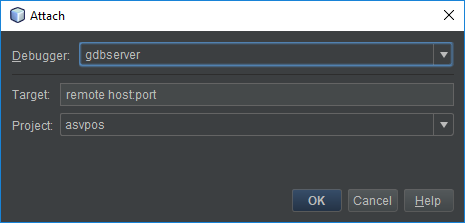
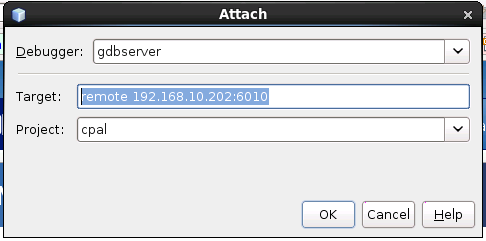
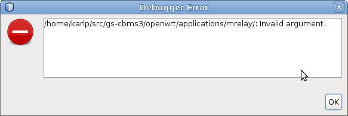
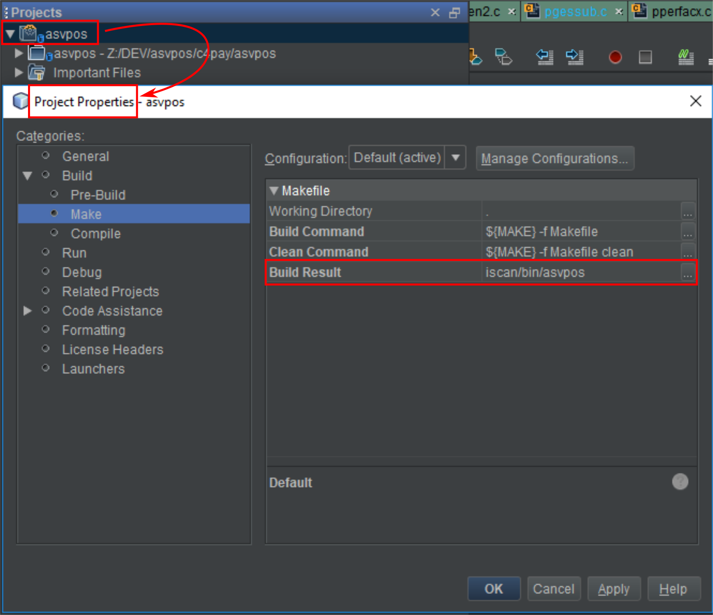

# HOW TO DEBUG A PROGRAM REMOTELY USING NETBEANS

## STEP 1

In the remote host run the program `gdbserver` along with the desired program.

```
gdbserver localhost:<port> <program_name>
```

or run the program first and then attach the `gdbserver` to it.

```
gdbserver localhost:<port> --attach <pid>
```

## STEP 2

Run in Netbeans the program `gdb` that connects with `gdbserver`, running in the remote host. 

`Menu Debug > Attach Debugger`



Example:



## [HOW TO SOLVE A PROBLEM THAT MAY HAPPEN WHEN DEBUGGING REMOTELY](http://false.ekta.is/tag/gdbserver/)

I was trying to do some remote debugging via gdbserver the other day, using netbeans. I knew I’d had this working before, but I kept getting a rather bizarre (to my mind) error dialog:



I could connect happily via `gdb` on the command line, and on a whim I tried a different project in netbeans, which worked as expected. A bit more thought, and some comparison in the project properties showed up what was missing, the name of the binary output built for this project. After filling it in again everything works just fine :)


