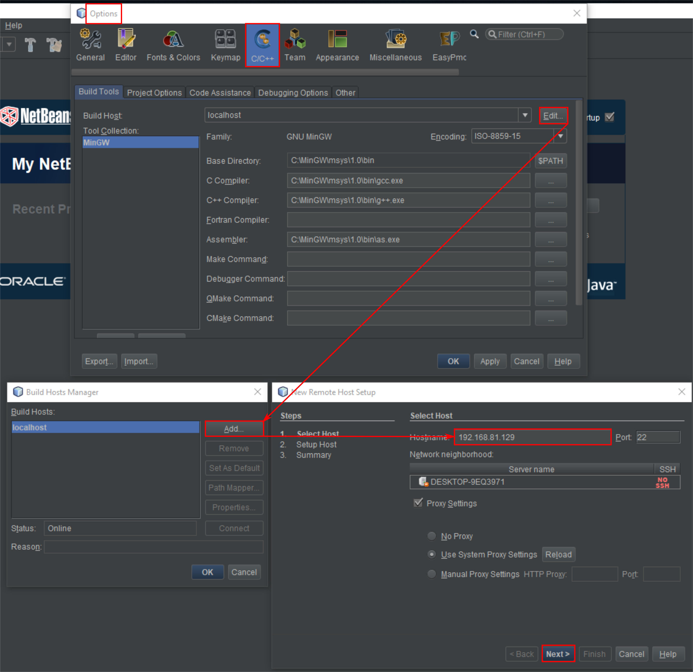
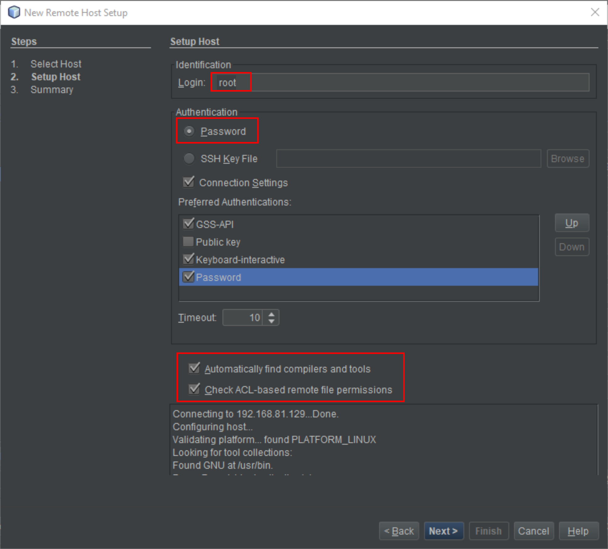
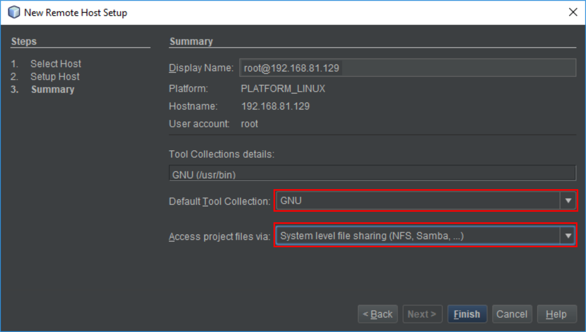
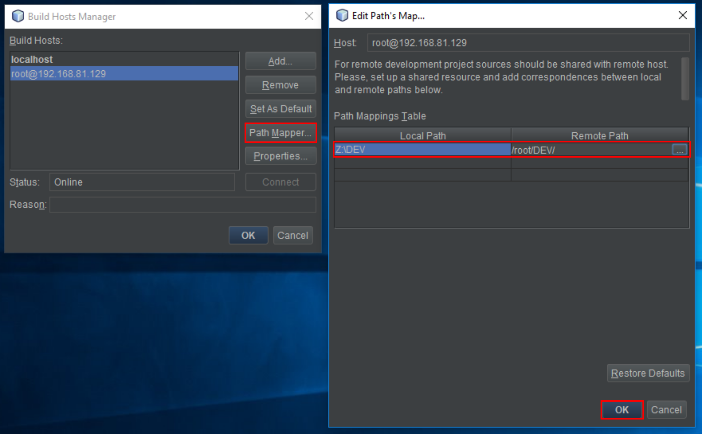
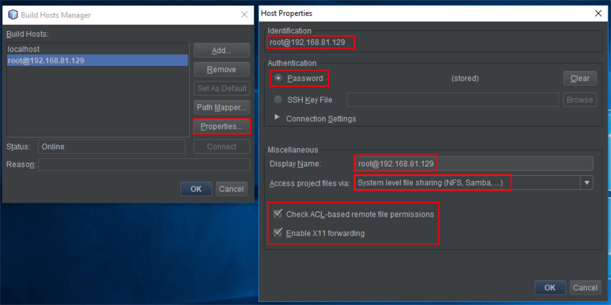
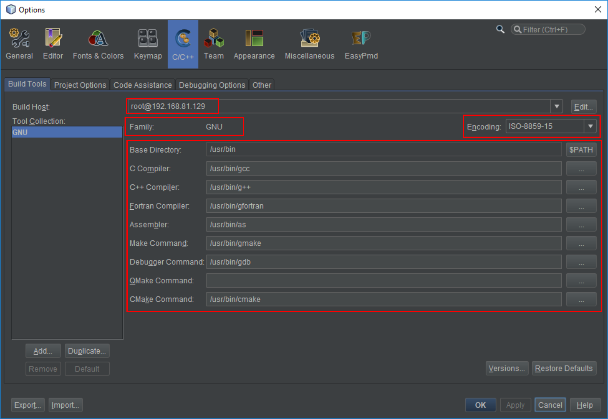
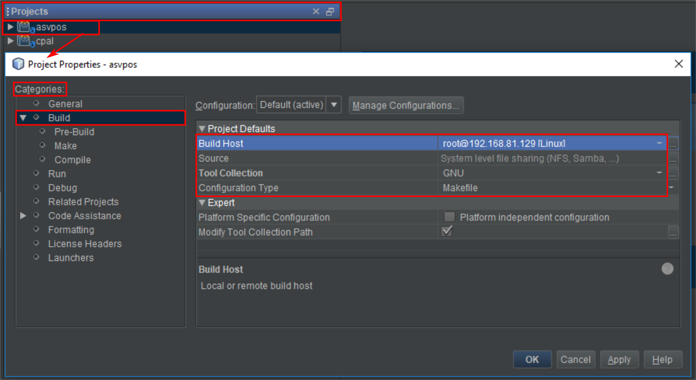

# HOW TO CONFIGURE NETBEANS TO BUILD A REMOTE PROJECT USING THE REMOTE HOST'S BUILD TOOLS

## Step 1

## Step 2

## Step 3

## Step 4

The drive `Z:/DEV` has been mount using the SAMBA service.

## Step 5

## Step 6

## Step 7

