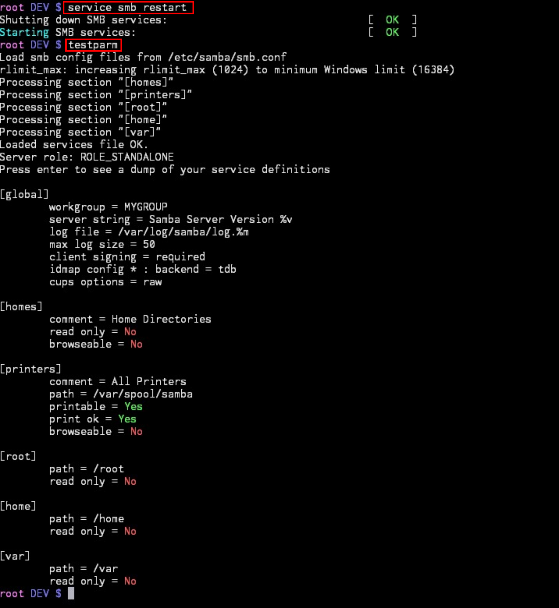
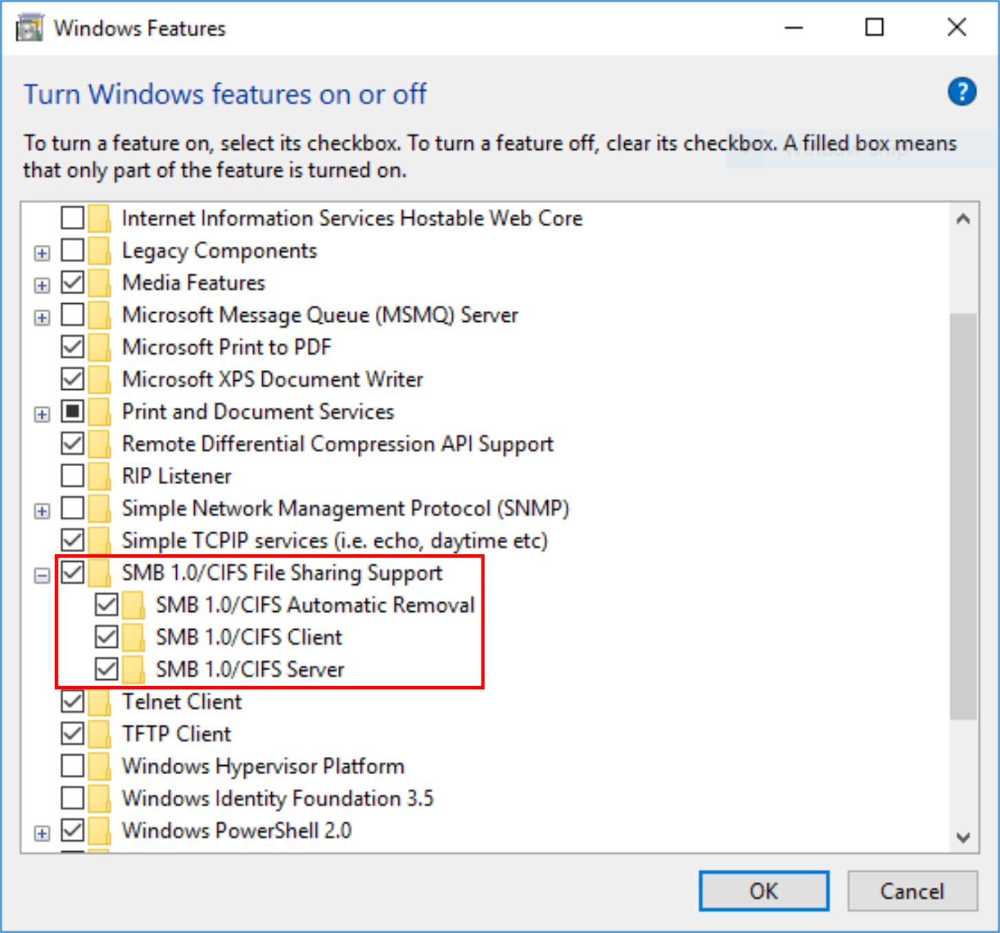
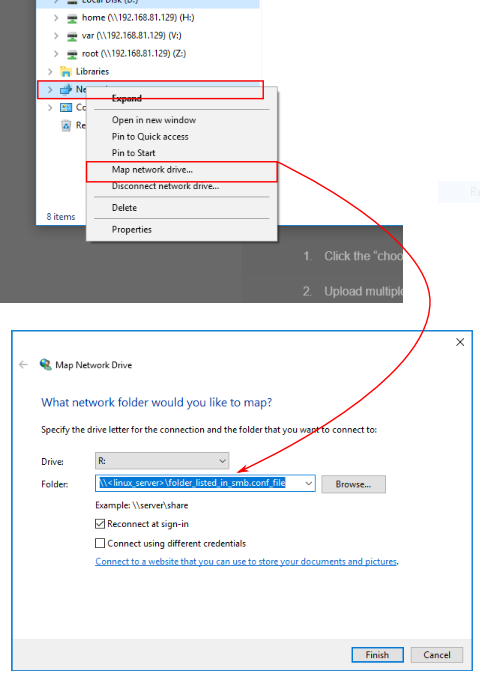

# SAMBA. SHARE FOLDERS BETWEEN LINUX AND WINDOWS 

* Configure in the file `/etc/samba/smb.conf` the folders you want to share.

```
...

[root]
path = /root
read only = no


[home]
path = /home
read only = no


[var]
path = /var
read only = no
```


* Enable in Windows 10 the Samba service.



* Map the Linux shared folders as network drives in Windows.




